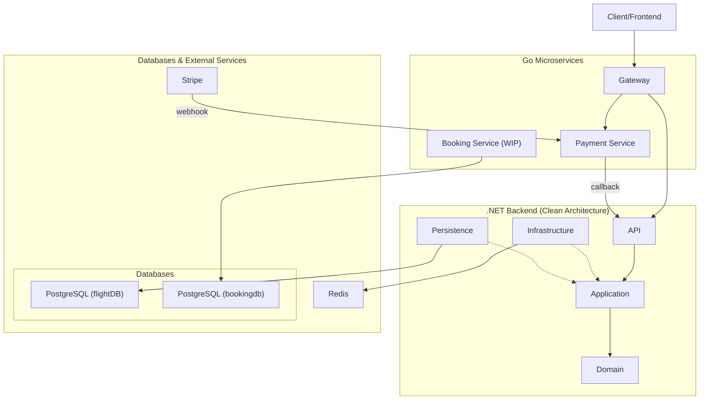

# AirlineBookingSystem

A modular airline reservation & booking system, composed of a .NET backend following Clean Architecture principles and supplementary microservices in Go.

## Table of Contents

1.  [Project Overview](#project-overview)
2.  [Features](#features)
3.  [Architecture & Design](#architecture--design)
4.  [Project Structure](#project-structure)
5.  [Technologies & Dependencies](#technologies--dependencies)
6.  [Setup & Running Locally](#setup--running-locally)
7.  [Configuration & Environment Variables](#configuration--environment-variables)
8.  [Database & Migrations](#database--migrations)
9.  [API Endpoints & Contracts](#api-endpoints--contracts)
10. [Asynchronous Workflows](#asynchronous-workflows)
11. [Testing](#testing)
12. [Future Enhancements](#future-enhancements)

---

## 1. Project Overview

AirlineBookingSystem is an integrated system to manage flights, bookings, ticketing, and related operations in an airline context. The backend is built with .NET 9, adhering to Clean Architecture principles for a clear separation of concerns, maintainability, and testability. The system is designed to be extensible with microservices written in Go to handle specific domains like payments.

The primary goals of this project are:
*   Allow users to search for flights, book seats, and manage their reservations.
*   Provide a robust, scalable backend for managing airline inventory (flights, seats, etc.).
*   Enable reliable asynchronous workflows for processes like payment confirmation.
*   Containerize the application for consistent development and deployment environments.

---

## 2. Features

*   **Flight Management:** Create, update, delete, and search for flights. Mark flights as departed or arrived.
*   **User Authentication:** Secure endpoints with JWT-based authentication.
*   **API Versioning:** Versioned API (defaulting to v1.0) for better client compatibility.
*   **Rate Limiting:** Basic protection against brute-force attacks with a fixed-window rate limiter.
*   **Caching:** Utilizes Redis for response caching to improve performance.
*   **Payment Processing:** Integration with Stripe for handling payments via a dedicated Go microservice.
*   **API Documentation:** Swagger/OpenAPI documentation for all endpoints.
*   **Comprehensive Data Model:** Manages airplanes, airports, gates, terminals, flight classes, and more.

---

## 3. Architecture & Design Principles

This project is a deliberate showcase of a modern, robust, and scalable software architecture. The design choices are centered around the principles of **Separation of Concerns**, **loose coupling**, and **high cohesion**, making the system resilient, adaptable, and easy to maintain.

### 3.1 Architectural Philosophy

The core philosophy is to combine the stability and structure of a **Domain-Driven Design (DDD)** approach in the .NET monolith with the flexibility and independent scalability of a **Microservices Architecture** for peripheral concerns.

-   **Why this hybrid approach?** It provides the best of both worlds. The core business logic (flights, users, etc.) benefits from the strong typing, consistency, and transactional integrity of a well-structured monolith. At the same time, specialized, high-throughput, or independently evolving tasks (like payment processing) are offloaded to small, efficient microservices, preventing them from complicating the core application.

### 3.2 Key Architectural Patterns in Use

| Pattern | Implementation | Purpose (The "Why") |
| :--- | :--- | :--- |
| **Microservices** | .NET Backend + Go Services | To isolate responsibilities, enable independent scaling, and improve fault tolerance. |
| **Clean Architecture** | .NET Backend Layers | To enforce separation of concerns and create a system independent of UI, database, and frameworks. |
| **CQRS** | MediatR in Application Layer | To separate read and write operations, simplifying logic and allowing for optimized data access. |
| **RESTful API** | .NET API Controllers | To provide a standardized, stateless, and scalable interface for client communication. |

### 3.3 System Architecture Diagram

The following diagram illustrates the flow of communication between these components:



### 3.4 SOLID Principles

SOLID is a set of five design principles that are fundamental to the Clean Architecture implementation, ensuring the code is understandable, maintainable, and flexible.

- **(S) Single Responsibility Principle:** Each class and method has one clear purpose. For example, a `CreateFlightCommandHandler` is solely responsible for the logic of creating a new flight.
- **(O) Open/Closed Principle:** The system is open for extension but closed for modification. By using interfaces for services and repositories (e.g., `IFlightRepository`), we can introduce new implementations (like a mock repository for testing) without altering the classes that use them.
- **(L) Liskov Substitution Principle:** Subtypes must be substitutable for their base types. This is ensured by adhering to the contracts defined by interfaces throughout the application.
- **(I) Interface Segregation Principle:** Clients should not be forced to depend on interfaces they do not use. We define granular interfaces (e.g., `IUserRepository`, `ITokenService`) rather than a single, monolithic "god" interface.
- **(D) Dependency Inversion Principle:** High-level modules do not depend on low-level modules; both depend on abstractions. This is the cornerstone of Clean Architecture. The Application layer depends on abstractions (interfaces), and the Infrastructure layer provides the concrete implementations, inverting the traditional flow of control.

### 3.5 Key Design Patterns in Use

Beyond the high-level architectural patterns, several well-established design patterns are used throughout the solution:

- **Repository & Unit of Work Patterns:** The Persistence layer uses these patterns to abstract the data access logic. The Repository pattern provides a clean API for data operations on an aggregate root, while the Unit of Work pattern manages transactions to ensure data consistency across multiple repository actions.
- **Mediator Pattern:** Implemented with **MediatR**, this pattern reduces direct dependencies between objects by forcing them to collaborate through a central mediator object. In our CQRS implementation, the mediator dispatches Commands and Queries to their respective handlers.
- **Dependency Injection (DI) & Inversion of Control (IoC):** The entire .NET application is built around DI. Services and repositories are defined by interfaces and injected into constructors, decoupling classes from their concrete dependencies. This is managed by the built-in .NET IoC container.
- **Options Pattern:** Used to bind strongly-typed configuration objects (e.g., `JwtSettings`) to configuration data from `appsettings.json` or environment variables.
- **Reverse Proxy Pattern:** The Go **Gateway** service acts as a reverse proxy, providing a single, unified entry point for clients and routing requests to the appropriate internal microservice.
- **Asynchronous Task-based Programming:** The extensive use of `async/await` throughout the .NET backend ensures the application is non-blocking, responsive, and can handle a high number of concurrent operations efficiently.

---

## 4. Project Structure

```
/
├── docker-compose.yml
├── docker-init-scripts/
│   └── init.sql
├── dotnet-backend/
│   ├── AirlineBookingSystem.API/
│   ├── AirlineBookingSystem.Application/
│   ├── AirlineBookingSystem.Domain/
│   ├── AirlineBookingSystem.Infrastructure/
│   ├── AirlineBookingSystem.Persistence/
│   ├── AirlineBookingSystem.Shared/
│   └── AirlineBookingSystem.UnitTests/
└── go-services/
    ├── booking/
    ├── gateway/
    └── payment/
```

*   **`docker-compose.yml`**: Orchestrates the `dotnet-api`, `postgres-db`, `redis-cache`, `go-booking-service`, and `go-payment-service` containers.
*   **`docker-init-scripts/`**: Contains SQL scripts to initialize the databases.
*   **`dotnet-backend/`**: The main .NET solution, structured with Clean Architecture.
*   **`go-services/`**: Contains the Go microservices.

---

## 5. Technologies & Dependencies

| Layer | Technology / Library | Purpose |
|---|---|---|
| Backend / API | .NET 9 | Core API, controllers, business logic |
| ORM / Data access | Entity Framework Core | Mapping domain to database |
| Database | PostgreSQL | Persistent storage |
| Caching | Redis | Caching responses and sessions |
| API Documentation | Swashbuckle (Swagger) | Generating OpenAPI documentation |
| Authentication | JWT Bearer | Securing API endpoints |
| Go services | Go 1.22 | Microservices for gateway, payment, etc. |
| Payment | Stripe | Payment processing |
| Containerization | Docker, Docker Compose | Local + production deployment |
| API Versioning | Microsoft.AspNetCore.Mvc.Versioning | Manages API versions |
| Environment | DotNetEnv | Loading environment variables from `.env` files |

---

## 6. Setup & Running Locally

The project is containerized and can be run easily with Docker Compose.

1.  **Prerequisites**
    *   Install Docker & Docker Compose.

2.  **Clone repository**
    ```bash
    git clone https://github.com/akram777077/AirlineBookingSystem.git
    cd AirlineBookingSystem
    ```

3.  **Configure environment variables**
    The .NET application loads configuration from environment variables. The `docker-compose.yml` file is already configured to provide the necessary variables to the `dotnet-api` service. For running outside of Docker, you would need to create a `.env` file in the `AirlineBookingSystem.API` directory.

4.  **Launch via Docker Compose**
    From the root directory, run:
    ```bash
    docker-compose up --build
    ```
    This command will:
    *   Build the Docker images for the `dotnet-api`, `go-booking-service`, and `go-payment-service`.
    *   Start containers for PostgreSQL, Redis, the .NET API, the Go booking service, and the Go payment service.
    *   Create two databases in PostgreSQL: `flightDB` and `bookingdb`.

6.  **Stop / clean up**
    ```bash
    docker-compose down
    ```

---

## 7. Configuration & Environment Variables

### .NET API (`dotnet-api`)

| Environment Variable | Description | Example from `docker-compose.yml` |
|---|---|---|
| `ConnectionStrings__DefaultConnection` | Connection string for the PostgreSQL database. | `Host=postgres-db;Port=5432;Database=flightDB;Username=postgres;Password=123` |
| `Redis__ConnectionString` | Connection string for the Redis cache. | `redis-cache:6379` |
| `ASPNETCORE_URLS` | The URLs the web server will listen on. | `http://+:8080` |

### Go Payment Service (`payment`)

| Environment Variable | Description | Example from `docker-compose.yml` |
|---|---|---|
| `STRIPE_SECRET_KEY` | Your secret key for the Stripe API. | `(user-provided)` |
| `STRIPE_WEBHOOK_SECRET` | Your Stripe webhook signing secret. | `(user-provided)` |
| `DOTNET_BACKEND_URL` | The URL of the .NET backend for payment confirmation callbacks. | `http://dotnet-api:8080` |

---

## 8. Database & Migrations

The system uses two PostgreSQL databases:
*   **`flightDB`**: The main database for the .NET application.
*   **`bookingdb`**: Intended for the Go booking service.

The schema for `flightDB` is managed using **EF Core Migrations**. The main entities include:
*   `Flight`, `Airplane`, `Airport`, `Gate`, `Terminal`
*   `User`, `Role`, `Permission`
*   `BookingStatus`, `FlightStatus`, `ClassType`
*   And many more, creating a comprehensive model for an airline system.

Relationships are defined using the Fluent API in the `Persistence` project. For example, a `Flight` has relationships with `Airplane`, `Gate`, and `FlightStatus`.

To apply migrations when developing locally (outside of Docker), you can use the .NET CLI:
```bash
dotnet ef database update --project dotnet-backend/AirlineBookingSystem.Persistence --startup-project dotnet-backend/AirlineBookingSystem.API
```

---

## 9. API Endpoints & Contracts

The API is versioned, with the base route for v1 being `/api/v1`. A complete list of all available endpoints is provided below. For interactive documentation, the Swagger UI can be accessed at `/swagger` when the application is running.

### Airplanes
| Method | Endpoint                                   | Description                                                |
| :----- | :----------------------------------------- | :--------------------------------------------------------- |
| `POST` | `/api/v1/airplanes`                        | Creates a new airplane.                                    |
| `GET`  | `/api/v1/airplanes`                        | Searches for airplanes with optional filters.              |
| `GET`  | `/api/v1/airplanes/{id}`                   | Retrieves a specific airplane by its ID.                   |
| `PUT`  | `/api/v1/airplanes/{id}`                   | Updates an existing airplane.                              |

### Airports
| Method | Endpoint                                   | Description                                                |
| :----- | :----------------------------------------- | :--------------------------------------------------------- |
| `GET`  | `/api/v1/airports`                         | Searches for airports with optional filters.               |
| `GET`  | `/api/v1/airports/{id}`                    | Retrieves a specific airport by its ID.                    |
| `PUT`  | `/api/v1/airports/{id}`                    | Updates an existing airport.                               |

### Authentication
| Method | Endpoint                                   | Description                                                |
| :----- | :----------------------------------------- | :--------------------------------------------------------- |
| `POST` | `/api/v1/auth/register`                    | Registers a new user.                                      |
| `POST` | `/api/v1/auth/login`                       | Authenticates a user and returns JWT tokens.               |
| `POST` | `/api/v1/auth/refresh`                     | Refreshes an access token using a refresh token cookie.    |
| `POST` | `/api/v1/auth/revoke`                      | Revokes the current user's refresh token. (Authorized)     |

### Booking Statuses
| Method | Endpoint                                   | Description                                                |
| :----- | :----------------------------------------- | :--------------------------------------------------------- |
| `GET`  | `/api/v1/booking-statuses`                 | Retrieves all booking statuses.                            |
| `GET`  | `/api/v1/booking-statuses/{id}`            | Retrieves a specific booking status by its ID.             |

### Cities
| Method | Endpoint                                   | Description                                                |
| :----- | :----------------------------------------- | :--------------------------------------------------------- |
| `GET`  | `/api/v1/cities`                           | Searches for cities with optional filters.                 |
| `GET`  | `/api/v1/cities/{id}`                      | Retrieves a specific city by its ID.                       |

### Class Types
| Method | Endpoint                                   | Description                                                |
| :----- | :----------------------------------------- | :--------------------------------------------------------- |
| `GET`  | `/api/v1/class-types`                      | Retrieves all class types.                                 |
| `GET`  | `/api/v1/class-types/{id}`                 | Retrieves a specific class type by its ID.                 |

### Countries
| Method | Endpoint                                   | Description                                                |
| :----- | :----------------------------------------- | :--------------------------------------------------------- |
| `GET`  | `/api/v1/countries`                        | Retrieves all countries.                                   |
| `GET`  | `/api/v1/countries/{id}`                   | Retrieves a specific country by its ID.                    |

### Flight Classes
| Method | Endpoint                                   | Description                                                |
| :----- | :----------------------------------------- | :--------------------------------------------------------- |
| `POST` | `/api/v1/flight-classes`                   | Creates a new flight class.                                |
| `GET`  | `/api/v1/flight-classes/by-flight/{flightId}` | Retrieves all flight classes for a specific flight.        |
| `GET`  | `/api/v1/flight-classes/{id}`              | Retrieves a specific flight class by its ID.               |
| `PUT`  | `/api/v1/flight-classes/{id}`              | Updates an existing flight class.                          |

### Flights
| Method | Endpoint                                   | Description                                                |
| :----- | :----------------------------------------- | :--------------------------------------------------------- |
| `POST` | `/api/v1/flights`                          | Creates a new flight. (Authorized)                         |
| `GET`  | `/api/v1/flights/search`                   | Searches for flights with optional filters. (Authorized)   |
| `GET`  | `/api/v1/flights/{id}`                     | Retrieves a specific flight by its ID. (Authorized)        |
| `PUT`  | `/api/v1/flights/{id}`                     | Updates an existing flight. (Authorized)                   |
| `DELETE`| `/api/v1/flights/{id}`                    | Deletes a flight. (Authorized)                             |
| `PATCH`| `/api/v1/flights/{id}/mark-departed`       | Marks a flight as departed. (Authorized)                   |
| `PATCH`| `/api/v1/flights/{id}/mark-arrived`        | Marks a flight as arrived. (Authorized)                    |

### Flight Statuses
| Method | Endpoint                                   | Description                                                |
| :----- | :----------------------------------------- | :--------------------------------------------------------- |
| `GET`  | `/api/v1/flight-statuses`                  | Retrieves all flight statuses.                             |
| `GET`  | `/api/v1/flight-statuses/{id}`             | Retrieves a specific flight status by its ID.              |

### Gates
| Method | Endpoint                                   | Description                                                |
| :----- | :----------------------------------------- | :--------------------------------------------------------- |
| `POST` | `/api/v1/gates`                            | Creates a new gate.                                        |
| `GET`  | `/api/v1/gates`                            | Searches for gates with optional filters.                  |
| `GET`  | `/api/v1/gates/{id}`                       | Retrieves a specific gate by its ID.                       |
| `PUT`  | `/api/v1/gates/{id}`                       | Updates an existing gate.                                  |

### Genders
| Method | Endpoint                                   | Description                                                |
| :----- | :----------------------------------------- | :--------------------------------------------------------- |
| `GET`  | `/api/v1/genders`                          | Retrieves all genders.                                     |
| `GET`  | `/api/v1/genders/{id}`                     | Retrieves a specific gender by its ID.                     |

### Payment
| Method | Endpoint                                   | Description                                                |
| :----- | :----------------------------------------- | :--------------------------------------------------------- |
| `POST` | `/api/v1/payment/create-payment-intent`    | Proxies to Go service to create a Stripe Payment Intent.   |
| `POST` | `/api/v1/payment/confirm-payment`          | Receives payment confirmation from the Go service.         |

### Permissions
| Method | Endpoint                                   | Description                                                |
| :----- | :----------------------------------------- | :--------------------------------------------------------- |
| `GET`  | `/api/v1/permissions`                      | Retrieves all permissions.                                 |
| `GET`  | `/api/v1/permissions/{id}`                 | Retrieves a specific permission by its ID.                 |

### Roles
| Method | Endpoint                                   | Description                                                |
| :----- | :----------------------------------------- | :--------------------------------------------------------- |
| `GET`  | `/api/v1/roles`                            | Retrieves all roles.                                       |
| `GET`  | `/api/v1/roles/{id}`                       | Retrieves a specific role by its ID.                       |
| `GET`  | `/api/v1/roles/{roleId}/permissions`       | Retrieves all permissions for a specific role.             |
| `POST` | `/api/v1/roles/{roleId}/permissions`       | Assigns a list of permissions to a role.                   |
| `DELETE`| `/api/v1/roles/{roleId}/permissions/{permissionId}` | Removes a permission from a role.                 |

### Seats
| Method | Endpoint                                   | Description                                                |
| :----- | :----------------------------------------- | :--------------------------------------------------------- |
| `POST` | `/api/v1/seats`                            | Creates a new seat.                                        |
| `GET`  | `/api/v1/seats/{id}`                       | Retrieves a specific seat by its ID.                       |
| `PUT`  | `/api/v1/seats/{id}`                       | Updates an existing seat.                                  |

### Terminals
| Method | Endpoint                                   | Description                                                |
| :----- | :----------------------------------------- | :--------------------------------------------------------- |
| `POST` | `/api/v1/terminals`                        | Creates a new terminal.                                    |
| `GET`  | `/api/v1/terminals`                        | Searches for terminals with optional filters.              |
| `GET`  | `/api/v1/terminals/{id}`                   | Retrieves a specific terminal by its ID.                   |
| `PUT`  | `/api/v1/terminals`                        | Updates an existing terminal.                              |

### Users
| Method | Endpoint                                   | Description                                                |
| :----- | :----------------------------------------- | :--------------------------------------------------------- |
| `POST` | `/api/v1/users`                            | Creates a new user.                                        |
| `GET`  | `/api/v1/users`                            | Searches for users with optional filters.                  |
| `GET`  | `/api/v1/users/{id}`                       | Retrieves a specific user by its ID.                       |
| `PUT`  | `/api/v1/users/{id}`                       | Updates an existing user.                                  |
| `DELETE`| `/api/v1/users/{id}`                      | Deletes a user.                                            |
| `PATCH`| `/api/v1/users/{id}/activate`              | Activates a user.                                          |
| `PATCH`| `/api/v1/users/{id}/deactivate`            | Deactivates a user.                                        |

---

## 10. Asynchronous Workflows

### Payment Confirmation

The payment process is a good example of an asynchronous workflow in the system:
1.  A client initiates a payment by calling the `go-payment` service to create a Stripe Payment Intent.
2.  The client uses the returned secret to complete the payment on the frontend with Stripe.
3.  Stripe sends a webhook to the `/webhook` endpoint of the `go-payment` service.
4.  The `go-payment` service verifies the webhook and, on a `payment_intent.succeeded` event, calls the `/api/Payment/confirm-payment` endpoint on the .NET backend to notify it of the successful payment.
5.  The .NET backend can then update the booking status accordingly.

---

## 11. Testing

The solution includes a unit test project, `AirlineBookingSystem.UnitTests`, for testing the application layer and domain logic.

To run the tests, use the `dotnet test` command:
```bash
dotnet test dotnet-backend/AirlineBookingSystem.sln
```

---

## 12. Future Enhancements

This project has a strong foundation, but there are many opportunities for expansion and improvement. The following roadmap outlines key areas for future development:

### Core Functionality & Architecture
- **Complete the Go Booking Service:** Fully implement the `go-booking-service` to handle the entire booking lifecycle, from seat selection to finalization. This will likely involve gRPC communication with the .NET backend for real-time inventory checks.
- **Implement the Saga Pattern:** For complex, multi-service transactions (e.g., a full "book and pay" workflow), implement the Saga orchestration pattern to ensure data consistency and reliable rollbacks across the `booking`, `payment`, and `dotnet-api` services.
- **Flesh out the API Gateway:** Fully integrate the `go-gateway` into the `docker-compose.yml` setup and enhance it with features like request aggregation, authentication offloading, and more granular per-client rate limiting.

### Frontend & User Experience
- **Build a Modern Frontend:** Develop a responsive and user-friendly web application using a modern framework like **React** or **Next.js**.
- **Real-time Notifications:** Add real-time capabilities using **SignalR** or **WebSockets** to provide instant updates to users about flight status changes, booking confirmations, and gate information.

### DevOps & Observability
- **CI/CD Automation:** Create a full **CI/CD pipeline** using **GitHub Actions** to automate testing, building, and publishing of Docker images to a container registry.
- **Comprehensive Observability:**
    - **Logging:** Integrate the **ELK Stack (Elasticsearch, Logstash, Kibana)** or **Prometheus + Loki + Grafana** for centralized, structured, and searchable logging across all microservices.
    - **Metrics & Monitoring:** Use **Prometheus** to scrape application metrics and **Grafana** to build dashboards for monitoring system health and performance.
    - **Distributed Tracing:** Implement **OpenTelemetry** across both the .NET and Go services to trace the full lifecycle of a request as it travels through the distributed system.

### Testing & Quality Assurance
- **Expand Test Coverage:**
    - **Integration Testing:** Write comprehensive integration tests for the .NET backend to validate the interactions between the Application layer and the database.
    - **End-to-End (E2E) Testing:** Create an E2E test suite using a framework like **Playwright** or **Selenium** to simulate user journeys and validate the system as a whole.
- **Contract Testing:** Introduce **Pact** to establish and verify contracts between the API services, ensuring that changes in one service don't break another.

### Security Enhancements
- **Granular Authorization:** Move beyond simple role-based access control to more granular, **claim-based authorization policies**.
- **Automated Security Scanning:** Integrate vulnerability scanning tools like **Snyk** or **Dependabot** into the CI/CD pipeline to automatically detect and report security issues in dependencies.